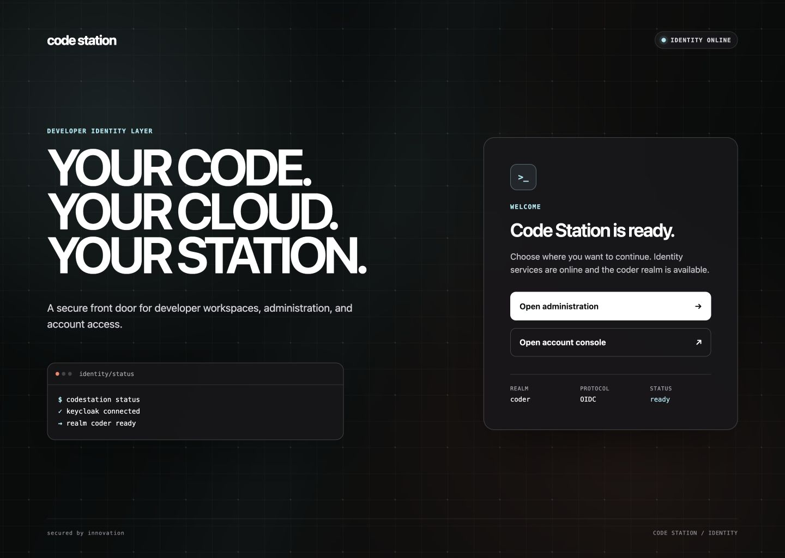

# Code Station theme for Keycloak

A developer-first Keycloak login, account, and welcome theme for Code Station, inspired by Coder's dark product experience. It uses black, white, BNP Paribas green, and ember, mono technical labels, and responsive interfaces without a language selector.

## Preview




The review set in `screenshots/` covers the login and Welcome experiences on desktop and mobile, the 930 px login width used during review, and a populated-field alignment check.

## Run locally

Requirements: Docker Desktop and Docker Compose.
The Compose preview binds Keycloak to the local loopback interface only.

```bash
docker compose up -d
./scripts/smoke-test.sh
```

Open the [Code Station account console](http://localhost:8080/realms/bnp-paribas/account). It starts the complete browser login flow and returns to a real Keycloak screen after authentication. The demo credentials are:

- Username: `developer`
- Password: `coder-demo`

The Keycloak admin console is available at [http://localhost:8080/admin](http://localhost:8080/admin) with `admin` / `admin`. These credentials and development mode are for local preview only.

Registration, password reset, and remembered sessions are enabled in the demo realm. The preview uses English without displaying a language selector.

The demo realm also exposes an unconfigured **OpenID Connect** entry so the alternative sign-in layout can be reviewed. It is a visual fixture only; configure real discovery/client settings before using that provider.

The [Code Station welcome page](http://localhost:8080/) stays available after bootstrap and provides direct access to the administration and account consoles.

Stop the preview with:

```bash
docker compose down
```

## Use in another Keycloak deployment

Mount or copy `theme/coder` to `/opt/keycloak/themes/coder`, then select `coder` as the realm's **Login theme** and **Account theme**. Start Keycloak with `--spi-theme--welcome-theme=coder` to activate the Welcome theme. The included `Dockerfile` is a minimal production-image example:

```bash
docker build -t keycloak-coder-theme .
```

The login theme extends `keycloak.v2`, the Account theme extends `keycloak.v3`, and the Welcome theme extends `keycloak`. All three are validated against Keycloak `26.7.0`. Re-test them when upgrading Keycloak because upstream FreeMarker, React, and PatternFly contracts can change.
The Welcome page's account shortcut intentionally targets the bundled `bnp-paribas` realm; update that link in `theme/coder/welcome/index.ftl` when deploying under another realm name.

## Structure

```text
theme/coder/login/
├── messages/            Localized UX copy
├── resources/css/       Responsive theme and states
├── resources/img/       Code Station terminal favicon
└── theme.properties     Keycloak theme declaration
theme/coder/account/
├── messages/             Accessible logo labels
├── resources/logo.svg    Code Station wordmark
└── theme.properties      Account theme declaration
theme/coder/welcome/
├── index.ftl             Welcome and bootstrap experience
├── resources/css/        Responsive Welcome styling
└── theme.properties      Welcome theme declaration
```

## Brand and accessibility notes

The login header always uses the Code Station name as text instead of the realm display name and contains no Coder logo asset. Image-based realm branding is suppressed, including the built-in Keycloak logo rendered by the `master` realm.
The Account theme preserves the complete upstream console and replaces only its masthead logo with the Code Station wordmark.
It is an independent, unofficial project and is not affiliated with or endorsed by Coder Technologies, Inc.

The implementation includes visible keyboard focus, associated native Keycloak labels, high-contrast controls, responsive layouts, and `prefers-reduced-motion` support. A BNP-green-and-ember workspace signal pulses behind a drifting network grid and is disabled when reduced motion is requested.
