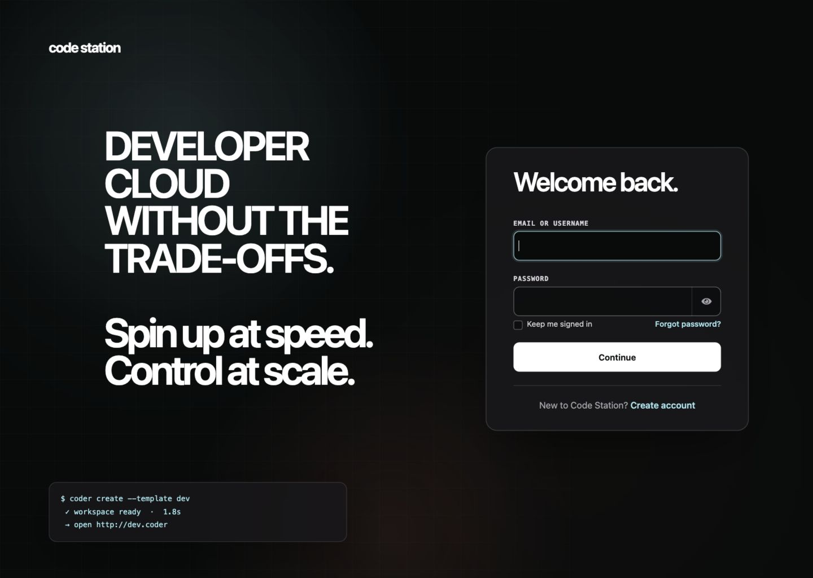

# Code Station theme for Keycloak

A developer-first Keycloak login theme for Code Station, inspired by Coder's dark product experience. It uses black, white, cyan, and ember, mono technical labels, and a responsive interface without a language selector.

## Preview



The review set in `screenshots/` covers desktop, the 930 px tablet width used during review, a 390 px mobile viewport, and a populated-field alignment check.

## Run locally

Requirements: Docker Desktop and Docker Compose.
The Compose preview binds Keycloak to the local loopback interface only.

```bash
docker compose up -d
./scripts/smoke-test.sh
```

Open the [Code Station account console](http://localhost:8080/realms/coder/account). It starts the complete browser login flow and returns to a real Keycloak screen after authentication. The demo credentials are:

- Username: `developer`
- Password: `coder-demo`

The Keycloak admin console is available at [http://localhost:8080/admin](http://localhost:8080/admin) with `admin` / `admin`. These credentials and development mode are for local preview only.

Registration, password reset, and remembered sessions are enabled in the demo realm. The preview uses English without displaying a language selector.

Stop the preview with:

```bash
docker compose down
```

## Use in another Keycloak deployment

Mount or copy `theme/coder` to `/opt/keycloak/themes/coder`, then select `coder` as the realm's **Login theme**. The included `Dockerfile` is a minimal production-image example:

```bash
docker build -t keycloak-coder-theme .
```

The theme extends `keycloak.v2` and is validated against Keycloak `26.7.0`. Re-test it when upgrading Keycloak because upstream FreeMarker and PatternFly contracts can change.

## Structure

```text
theme/coder/login/
├── messages/            Localized UX copy
├── resources/css/       Responsive theme and states
├── resources/img/       Code Station terminal favicon
└── theme.properties     Keycloak theme declaration
```

## Brand and accessibility notes

The theme uses the Code Station name as text and contains no Coder logo asset.
It is an independent, unofficial project and is not affiliated with or endorsed by Coder Technologies, Inc.

The implementation includes visible keyboard focus, associated native Keycloak labels, high-contrast controls, responsive layouts, and `prefers-reduced-motion` support. A slow cyan-and-ember ambient glow moves behind the static grid and is disabled when reduced motion is requested.
